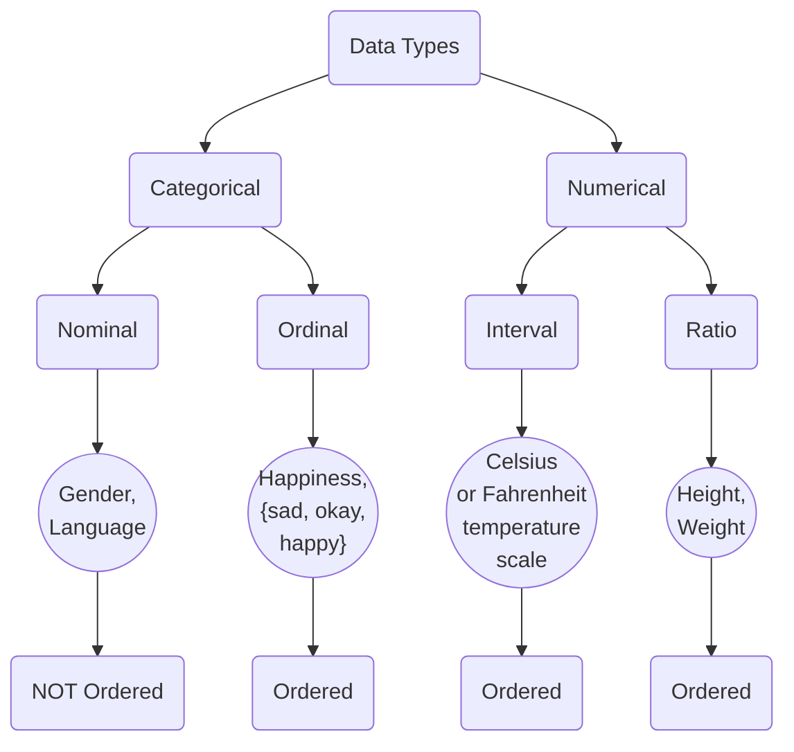

```mermaid
graph TB;
%% If you see this code instead of an image, please add this extension to your browser, such as:
%% https://chrome.google.com/webstore/detail/markdown-diagrams/pmoglnmodacnbbofbgcagndelmgaclel
	dataTypes(Data Types)
	dataTypes-->categorical(Categorical)
	dataTypes-->numerical(Numerical)
	categorical-->nominal(Nominal)
	categorical-->ordinal(Ordinal)
	numerical-->interval(Interval)
	numerical-->ratio(Ratio)
	nominal-->nominalExample((Gender, <br/>Language))
	ordinal-->ordinalExample(("Happiness, <br/> {sad, okay,<br/> happy}"))
	interval-->intervalExample((Celsius <br/>or Fahrenheit <br/>temperature <br/>scale))
	ratio-->ratioExample((Height, <br/>Weight))
	nominalExample-->nominalOrder(NOT Ordered)
	ordinalExample-->ordinalOrder(Ordered)
	intervalExample-->intervalOrder(Ordered)
	ratioExample-->ratioOrder(Ordered)
```
